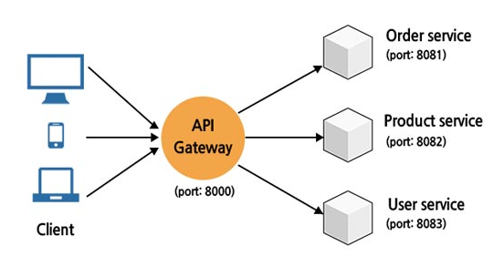
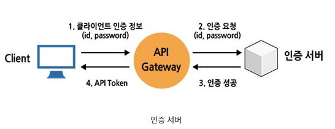
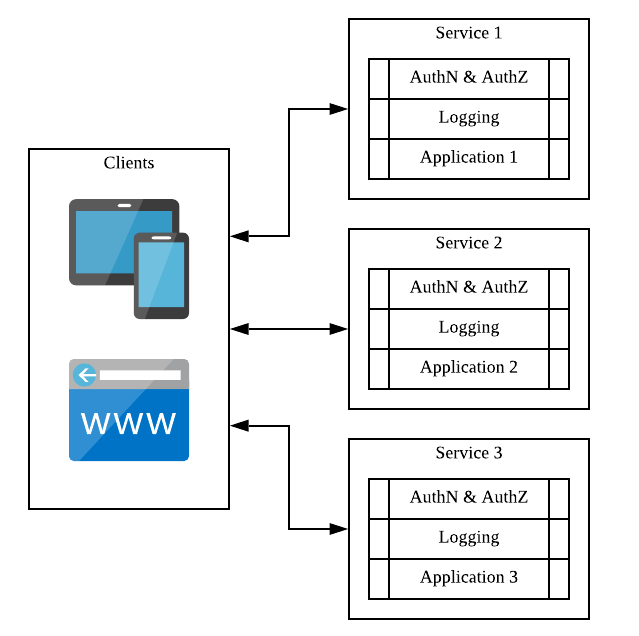
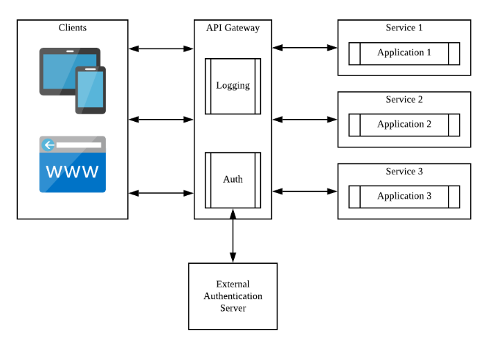
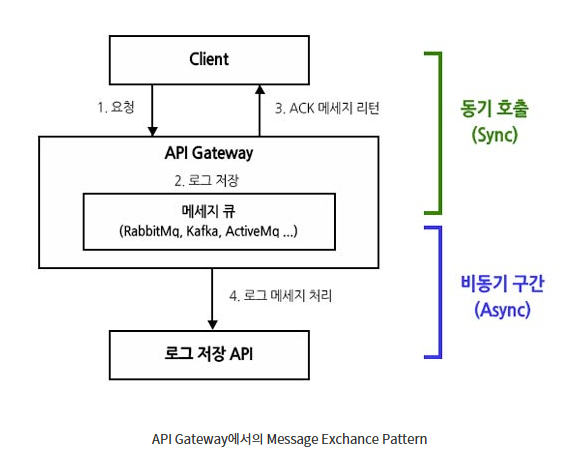
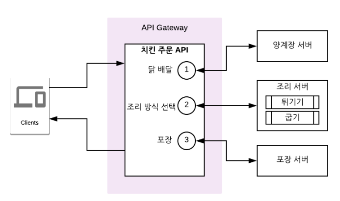
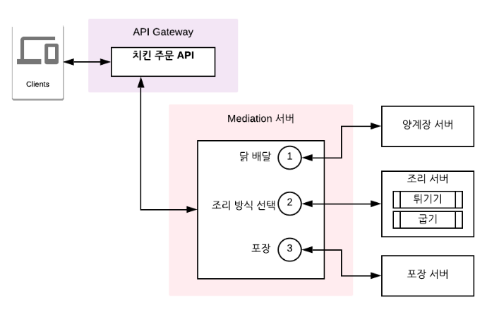
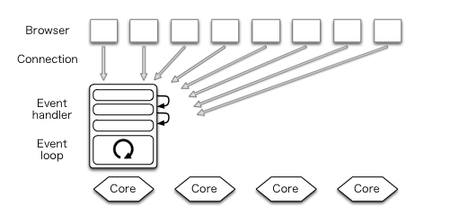
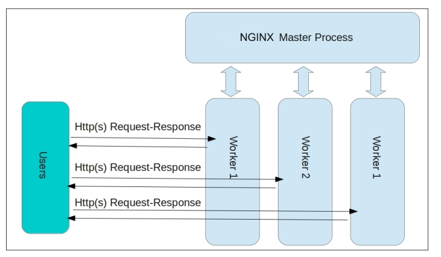

# API Gateway 란?

### 개념도 <br>


<br><br>

### 0. API 게이트웨이의 등장 배경
- 많은 서비스들이 발전/개선되며 점차 규모가 확장되고 복잡해짐. <br> 
  `어떻게 하나의 시스템에서 많은 서비스들을 독립적인 기능을 수행하는 작은 단위로 서비스할 수 있을까?`라는 고민 끝에 나온 것이 MSA. <br>
  하지만, 이 MSA에서도 서비스의 작은 단위가 50개, 100개가 넘어가면 End-Point 관리가 어려워지고 <br>
  각각의 서비스의 공통기능(ex : 인증/인가, 로깅 등)들을 중복 개발해야 하는 문제가 발생. <br><br>

  이러한 문제를 해결하고자 나온 것이 `API Gateway`이다.

<br><br>


### 1. API 게이트웨이(API Gateway)란?
- 클라이언트와 각 서비스들 사이에 위치하여 클라이언트의 요청을 API Gateway가 받아서 <br>
  설정에 따른 각 엔드포인트로 클라이언트를 대신하여 서비스들에게 요청을 전달하고 <br>
  서비스로부터 결과를 응답받으면 이를 클라이언트에게 전달하는 `프록시(Proxy)` 역할을 수행함. <br><br>

  당연히, 요청과 응답을 API 게이트웨이가 전담하므로 클라이언트는 내부 서비스의 아키텍처를 알 수 없게됨으로써 <br>
  자연스럽게 프록시의 장점 중 하나인 `캡슐화`의 특징을 가짐 -> 정보 은폐 <br><br> 

  위와 같이 클라이언트의 요청을 라우팅하는 것 외에도 `단일 진입점`의 이점으로 인해 추가로 구현할 경우, 장점이 많음. <br>
  
<br><br>

### 2. API 게이트웨이의 주요기능
#### 1) 인증/인가 및 토큰 발급 <br>


- 인증/인가의 경우, 각 서비스마다 공통으로 구현되어야 하는 필수적인 기능 <br>
  각 서비스 마다 인증/인가 처리 구현 시, 매우 비효율적 -> `API Gateway`에서 처리하도록 일임. <br>
  (ex : Spring에서 각 서비스에 Spring Security 의존성을 추가해 해당 기능을 구현하는 것) <br><br>
  
  또한, API 사용을 위한 토큰 발급 기능도 마찬가지 이유로 `API Gateway`에서 처리 <br>
  실제로 토큰 발급 기능은 인증을 위한 서비스(인증서버)를 하나 두고 처리되게끔 함. <br><br>


#### 2) 공통 로직 처리 <br>

 | 
---|---|

- 인증/인가 외에도 여러 서비스에서 공통적으로 처리해야 할 기능은 많음. <br>
  공통된 기능을 각 서비스마다 구현하는 것은 생산성/유지보수성 비효율적 <br><br>

  공통 로직의 경우 `API Gateway`에서 구현되는 것이 효율적 -> 개발 중복을 줄일 수 있고 `표준 준수`도 쉬움. <br>
  특히 MSA아키텍처의 경우, API 게이트웨이가 없다면 MSA에서 각 서비스 컴포넌트가 이러한 공통 기능들을 중복으로 가져야 하는 문제가 발생. 

<br><br>

#### 3) API 라우팅
- `API 게이트웨이`는 API호출을 라우팅하는 것에도 유용함 <br>
  동일한 API에 대한 호출이 있더라도, 대상 서비스나 클라이언트에 따라 다른 엔드포인트를 이용하도록 할 수 있음. <br><br>
  
  - [서비스 & 클라이언트 별 엔드포인트 제공]
    - 하나의 시스템이 다양한 서비스를 다양한 클라이언트에 나뉘어 제공할 때, 각각의 서비스와 클라이언트 별, 다른 엔드포인트를 제공할 수 있음. <br><br>
      -> 즉, API 서버가 공통적인 API를 가지더라도, 다르게 제공하는 엔드포인트를 통해 다른 서비스 or 클라이언트를 위한 API 서비스가 가능.

    <br><br>    

  - [메시지/헤더 기반 라우팅]
    - 메시지나 헤더의 내용을 기반으로 API 라우팅을 할 수 있음. <br>
      특히, 글로벌 단위로 배포되는 시스템에서 데이터 센터 간 메시지 라우팅 시, 유용하게 사용됨 <br>
      라우팅 정보 추출 시, API 게이트웨이가 메시지 파싱 시 많은 리소스가 소요될 수 있음. <br><br>
    
      `API 게이트웨이`가 REST API 형태의 엔드포인트를 클라이언트에게 제공 시, 라우팅 정보를 `HTTP 헤더` 부분에 넣고 <br>
       API 게이트웨이는 `헤더만 파싱하여 라우팅 정보를 추출`, API 서버로는 `HTTP 바디를 포워딩하는 용도로만 사용`하여 <br>
       API 게이트웨이의 부하를 줄여주는 것이 좋음. <br><br>

  - [로드 밸런싱]
    - 대용량 처리 서비스에 있어서 로드밸런싱은 필수적. <br> 
      기본적으로 여러 개의 API 서버를 두어 부하 분산하는 기능으로 쓰이지만, <br>
      API 서버 장애 시, 이를 감지해서 로드밸런싱 리스트에서 빼고, 복구되었을 때 다시 로드밸런싱 리스트에 넣는 기능들이 필요 (health-Check)

<br><br>

#### 4) 메디에이션(Mediation)
- 클라이언트에서 호출하는 요청과 API 서버가 제공하는 API의 스펙에 차이가 발생 시, 이를 중간에서 중재하는 기능을 의미. <br><br>

- 메시지 포맷 변환 (Message Format Transformation) 
  - 클라이언트와 서버가 서로 다른 메시지 포맷을 채택하고 있을 때, 이를 적절하게 변환시켜주는 기능을 의미. <br>
  - 클라이언트의 요청을 하위 서비스가 처리할 수 있도록 데이터 형식을 변형하거나 <br>
    하위 서비스의 응답 표준 포맷으로 데이터 형식으로 치환함. <br><br>

- 프로토콜 변환
  - 다양한 서비스 및 클라이언트를 지원하게 되면, 각 서비스 및 클라이언트가 다른 통신 프로토콜을 사용해야하는 경우가 발생할 수 있음. <br>
    특히, 내부 API는 gRPC와 같은 차세대 프로토콜을 이용해 구현하면서도, 외부로는 REST API를 통해 서비스 함으로써, <br>
    내부 API의 성능을 올리면서도 범용성을 높이는 것이 가능함. <br><br>

- 메세지 호출 변환(Message Exchange Pattern) <br>
   <br>
  - 메세지 호출 패턴은 동기(Sync), 비동기(Async)와 같은 API를 호출하는 메세지 패턴을 정의하는 것. <br>
    API Gateway를 이용하면 다음과 같이 `동기 호출` -> `비동기 호출`로 변경 가능함. <br>


<br><br>


#### 5) 어그리게이션(Aggregation)
- 서로 다른 API를 묶어서 하나의 API로 제공하는 것을 의미. 
- 예를 들어, 치킨을 조리하고 포장하는 작업을 하나의 API로 제공한다고 가정해보자. <br>
  1. 양계장에서 닭 배달
  2. 조리 방식 선정 (튀기기 or 굽기)
  3. 포장 <br>

치킨의 조리부터 포장까지 마치기 위해서 위 3개의 서로 다른 서비스의 API를 호출한다고 했을 때, <br>
이를 API 게이트웨이에서 aggregation 한다면 다음과 같은 형태로 구현할 수 있음. <br>

<br>
다만, 과도한 `aggregation`은 API 게이트웨이에 부담을 줄 수 있음. <br>
이와 같은 문제를 해결하기 위해서, 다음과 같이 여러 API를 조합하는 목적의 `mediation API`서버 계층을 도입할 수 있음. <br>




### 3. 상용화된 API Gateway는 어떤 것이 있을까?
- Amazon API Gateway, Kong Gateway, Tyk, KrakenD, Spring Cloud Gateway 등이 있음. <br><br>

<br><br>


# Nginx 란?

- 가벼움과 높은 성능을 목표로 하는 경량 웹 서버 SW로, 웹서버, 리버스 프록시 및 메일 Proxy 기능을 가짐.
- `Event-Driven 구조`로 동작하기 때문에 1개 또는 고정된 프로세스만 생성하여 사용하고 <br>
  비동기 방식으로 요청들을 Concurrency하게 처리할 수 있음. <br><br>

- 새로운 요청이 들어오더라도 새로운 프로세스와 쓰레드를 생성하지 않기 때문에 프로세스와 쓰레드 생성 비용이 존재 X <br>
  적은 자원으로도 효율적인 운용이 가능 -> 단일 서버에서도 동시에 많은 연결 처리가 가능. <br><br>

- `Event-Driven`
  - apache의 C10K 문제점 해결(하나의 시스템에 동시 접속자가 1만명이 넘어갈 때 효율적 방안)을 위해 만들어진 구조. <br>
    OSI7 LAYER 중 application Level 아래의 Level에서 Nginx 같은 웹서버가 HTTP 통신을 담당함. <br><br>

  
- 정적 파일을 제공(HTML, CSS 등) 하는 웹서버의 역할도 하면서 Proxy의 역할도 수행.
- SSL 터미네이션을 지원하며 데이터 압축/비동기 처리 등 다양한 기능을 제공함.
- Nginx가 클라이언트와 HTTPS 통신을 수행하고 서버와는 http 통신을 하게됨.
  - 서버가 복호화 과정을 담당하지 않아도 됨 -> 비즈니스 로직에 집중 가능 -> 부하 감소.
<br><br>

- 보통 Nginx는 서버와 같은 네트워크 상에 위치하기 때문에 http 통신을 해도 보안 이슈가 비교적 적음. <br>
- 한 번 서버로부터 받은 response를 보관하고 클라이언트에게 response하는 `캐싱`의 이점이 있음.

<br><br>


### 0. Nginx 등장 배경
- <br>
  `어떻게 하나의 시스템에서 많은 서비스들을 독립적인 기능을 수행하는 작은 단위로 서비스할 수 있을까?`라는 고민 끝에 나온 것이 MSA. <br>
  하지만, 이 MSA에서도 서비스의 작은 단위가 50개, 100개가 넘어가면 End-Point 관리가 어려워지고 <br>
  각각의 서비스의 공통기능(ex : 인증/인가, 로깅 등)들을 중복 개발해야 하는 문제가 발생. <br><br>

  이러한 문제를 해결하고자 나온 것이 `API Gateway`이다.

<br><br>


### 1. Nginx의 구조

- Master Process와 다수의 Worker Process로 구성되어 실행됨. <br>
  Master Process는 설정 파일을 읽고 유효성을 검사 & Worker Process를 관리함. <br>

- 모든 요청은 `Worker Process`에서 처리함. <br>
  Nginx는 이벤트 기반 모델을 사용하고 Worker Process 사이에 요청을 효율적으로 분배하기 위해 OS에 의존적인 매커니즘을 사용. <br>
  Worker Process의 개수는 설정파일에서 정의되며, 정의된 프로세스 개수 & 사용 가능한 CPU 갯수에 맞게 자동으로 조정됨. <br><br>

- 설정 파일 default path
  - `/etc/nginx/nginx.conf` <br><br>
  
  - 위 경로 없을 시
    - `/user/local/nginx/conf/nginx.conf` 또는 `/usr/local/etc/nginx/nginx/conf` 


- Nginx 모듈은 설정파일에 있는 지시어(directive)에 의해 제어됨. directive는 `simple directive`와 `block directive` 2가지 종류가 있음 <br><br><br>
  
- `Simple Directive` : 이름과 값이 있고 세미콜론으로 끝남
  ```yaml
    worker_process 1;
  ```
  
- `Block Directive` : 블록을 통해서 여러 directive를 감싼 형태로 정의됨.
  ```yaml
    http {
      server {
        location / {
                root /path/to/html;
        }
  
        location /images/ {
                root /path/to/image;
        }
      }
    }
  ```


#### 자료 인용 출처
https://kinchi22.github.io/2019/09/22/api-gateway/ <br>
https://wildeveloperetrain.tistory.com/205 <br>
https://velog.io/@wijihoon123/Nginx%EB%9E%80-%EB%AC%B4%EC%97%87%EC%9D%B8%EA%B0%80 <br>

