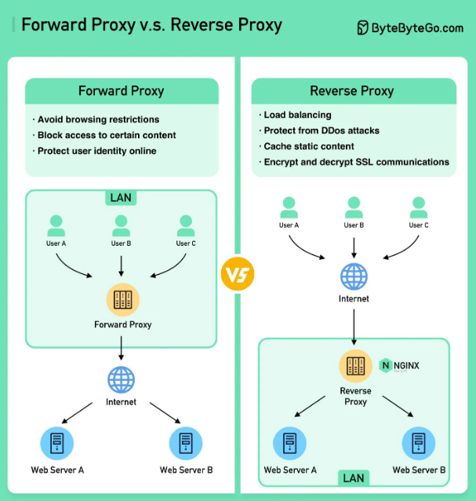

# Reverse Proxy (리버스 프록시)

### 0. 모식도  

### 1. 포워드 프록시란(Forward Proxy) ? 
- 사용자 기기와 인터넷 사이에 위치하는 서버

 

### 2. 용도
- 클라이언트 보호
- 탐색 제한을 우회
- 특정 콘텐츠에 대한 액세스 차단 

 

### 3. 리버스 프록시란(Reverse Proxy) ?
- 클라이언트의 요청을 수락하고 해당 요청을 웹서버로 전달하고 마치 프록시 서버가 요청을 처리한 것처럼 그 결과를 클라이언트에 반환하는 서버

 

### 4. 용도
- 서버 보호
- 부하 분산
- 정적 콘텐츠 캐싱처리
- SSL 통신 암호화 및 복호화

  
