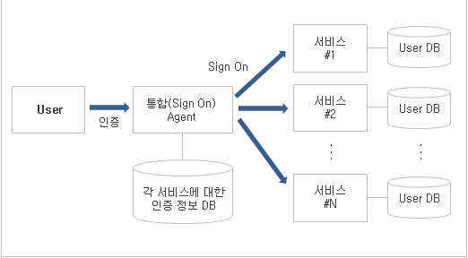
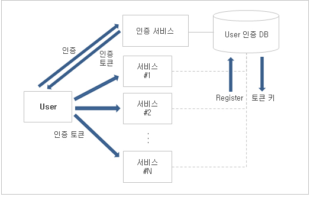

# SSO 아키텍처 란?

### 개념도  

  

### 0. SSO (Single Sign-On) 아키텍처 등장 배경
- 기업의 서비스가 그룹화 or 확장됨에 따라 여러 사이트들을 통합 관리하는 경우 SSO를 사용함.
  이때, 통합 인증 SSO를 사용하게 되면, 관리자는 보다 수월하게 관리 대상(사용자 및 고객)을 관리할 수 있게 됨.

- 기술적 측면
  - 기업 내, 다양한 정보 시스템의 구축에 따른 복잡성 증가, PKI, 생체 인식 등 다양한 인증 기술의 활성화
  
- 관리적 측면
  - 중앙 관리를 통한 업무 단순화 및 표준화 실현, 중앙 집중적인 사용자 관리를 통한 보안 기능 강화
  

  

### 1. SSO 란?
- 단 한번의 시스템 인증을 통해 접근하고자 하는 많은 정보시스템에 재인증 절차 없이 접근할 수 있게 하는 기능.  
  한 개의 ID / Password 로 여러 시스템에 접근할 수 있는 통합 로그인(인증) 솔루션  

 

### 2. SSO의 구성 요소
| 구성        | 설명                                                                      |
|-----------|-------------------------------------------------------------------------|
| 사용자       | 개별 ID, Password로 로그인 시도                                                 |
| 인증 Server | ACL (Access Control List)을 통한 통합 인증 서버                                  |
| SSO Agent | 각 정보시스템에 인증 정보 제공 (token)                                               |
| LDAP      | 네트워크 상의 자원을 식별하고, 사용자와 Application이 자원에 접근할 수 있도록 하는 네트워크 Directory 서비스 |

 

### 3. SSO의 요구기능 & 주요 기술 요소
| 기능  | 설명                                           |
|-----|----------------------------------------------|
| 생산성 | 운영체계, 네트워크, Database 등 접속 환경에 관계없이 접속 가능해야 함 |
| 보안성 | Logic 정보가 Cache되거나 사용자 PC에 저장되지 않아야 함        |
| 확장성 | 어플리케이션에 관계 없이 Logging이 필요한 곳에 확장 가능해야 함      |

| 구성   | 기술 요소                                   | 내용 |
|------|-----------------------------------------|---|
| 인증   | PKI : 비대칭키 (공개키, 비밀키) 기반의 인증 및 암호화   |
| 관리   | ACL (Access Control List)을 통한 통합 인증 서버  |
| 기술   | 각 정보시스템에 인증 정보 제공 (token)               |

<table>
  <thead>
  <tr>
    <th>구성</th>
    <th>기술 요소</th>
    <th>내용</th>
  </tr>
  </thead>

  <tbody>
    <tr>
      <td rowspan="3">인증</td>
      <td>PKI</td>
      <td>비대칭키(공개키, 비밀키) 기반의 인증 및 암호화</td>
    </tr>
    <tr>
      <td>생체인식</td>
      <td>생체 유일한 특징을 추출해 인증</td>
    </tr>
    <tr>
      <td>OTP</td>
      <td>로그인 시, 세션에서만 사용할 수 있는 1회 패스워드 생성 시스템</td>
    </tr>
    <tr>
      <td rowspan="2">관리</td>
      <td>LDAP</td>
      <td>X.500을 근거로 한 디렉토리 DB에 접속하기 위한 통신규약</td>
    </tr>
    <tr>
      <td>쿠키</td>
      <td>웹서버가 웹 브라우저에 보내어 저장했다가 서버의 부가적 요청이 있을 시, 서버로 보내주는 작은 용량의 파일</td>
    </tr>
    <tr>
      <td rowspan="2">기술</td>
      <td>SSL</td>
      <td>클라이언트-서버 간의 보안 기능을 수행하는 TCP/IP 상위에서 수행되는 보안 프로토콜</td>
    </tr>
    <tr>
      <td>IPSec</td>
      <td>IP계층을 기반으로 보안 프로토콜을 제공하는 개방형 프레임워크</td>
    </tr>
  </tbody>
</table>

- 인증
  - PKI (Public Key Infra structure), 생체인식, OTP(One Time Password)   

- 관리
  - LDAP(Lightweight Directory Access Protocol), 쿠키(Cookie)   
  
- 암호화 통신
  - SSL (Secure Socket Layer), IPSec(IP Security Protocol)

 

### 4. SSO의 구축 유형
| 인증 대행 모델 (Delegation)                                            | 인증 정보 전달 모델 (Propagation)                                                  |
|------------------------------------------------------------------|----------------------------------------------------------------------------|
                                               |                                                     
| - 인증 방식을 변경하기 어려울 경우, 많이 사용   - 시스템 접근 시, 통합 Agent가 인증 작업을 대행 | - 웹 기반의 시스템에 주로 사용   - 미리 인증된 토큰(Cookie 기능 이용)을 받아서 각 시스템 접근 시, 자동으로 전달 |

  

### 5. Cookie를 이용한 SSO 구현 시, Cookie 보안 방법
- 데이터 기밀 유지 (Data Confidentiality)
  - 토큰은 주요 암호 알고리즘(AES, SEED)과 128bit 이상의 키로 암호화 되어야 함.   
  
- 데이터 무결성 (Data Integrity)
  - 토큰은 MAC 등을 포함해 데이터의 무결성을 보장해야 함.   

- 사용자 주소 제한이나 유효 시간 제한 같은 보안 기술을 사용하여, 토큰을 네트워크에 노출시키지 않아야 함.

  

#### 자료 인용 출처
http://jidum.com/jidums/view.do?jidumId=622  

