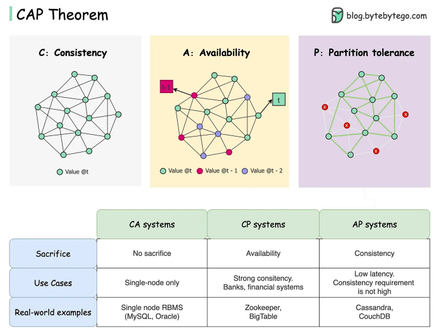
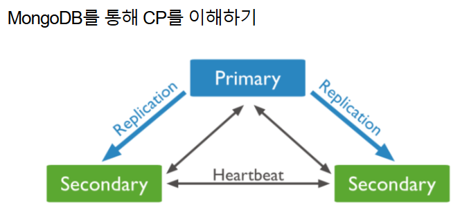
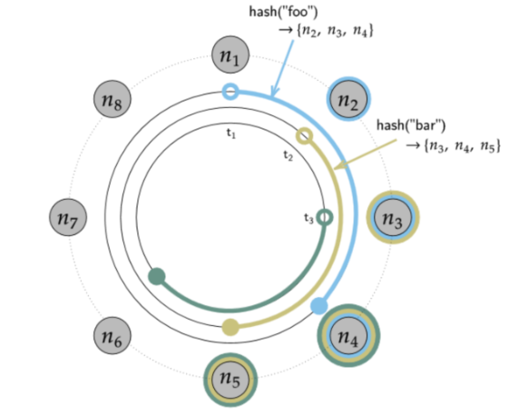

# 분산 데이터베이스 시스템 (CAP 이론 포함)

### 0. 모식도  

### 들어가기에 앞서 용어정리
1) 일관성 (Consistency) 
   - 클라이언트가 분산DB상의 어떤 노드와 통신하는 지 상관없이 동일한 데이터를 조회할 수 있는 것을 의미. 
   - 조회하는 데이터는 가장 최근에 쓰여진 데이터. 
   - 따라서, 만약 하나의 노드에 쓰기 작업이 이루어졌다면, 이는 모든 복제본 노드에 반영이 되어야 하고  
     사용자가 어떤 노드와 통신하는 지와 상관없이 같은 데이터를 보여주게끔 함.   
   
     그러나 시스템이 모든 인스턴스에 변경 내용을 즉각 반영하는 것은 사실상 불가능하므로  
     일관성의 목표는 데이터의 동기화가 충분히 빨라 사용 상의 문제가 없게끔 하는 것.   
   
     ex) 금융 앱 이용 시, PC나 스마트폰, 태블릿 or 어떤 매체를 통해서 보든지 상관없이 같은 잔고를 확인할 수 있어야 함.
     
 

2) 가용성 (Availability)
   - 일부 노드가 다운되어도 데이터를 요청하는 모든 클라이언트가 응답을 받는 것을 의미.  
     즉, 모든 요청이 응답을 받을 수 있어야 함. 사용자가 읽기 작업을 하든 쓰기 작업을 하든 심지어 작업이 실패했더라도 사용자는 응답을 받을 수 있어야 함.  
     -> 시스템이 중단되는 일 없이 언제든지 사용 가능한 상태여야 함을 의미.   
   
     예를 들어, 스마트폰과 PC에서 은행앱을 사용할 때, 서로 잔고가 일치하지 않더라도 잔고 조회는 할 수 있어야 함.
   
 

3) 분할 허용 (Partition tolerance)
   - 분할은 두 노드 간의 통신 중단을 나타냄.  
     즉, 한 노드가 다른 노드와 통신할 수 없을 때, 분할이 생겼다고 지칭. 원인은 다양함(ex : 서버장애, 네트워크 장애 등)   
   - 시스템 내 분할이 생겼을 때에도 시스템이 여전히 작동함을 의미.  
     (한 노드가 다른 노드와 통신이 불가능할 때, 다른 복제 노드가 사용자 요청에 응답할 수 있어야 함)  
     이 말은 즉, 데이터의 복제본을 여러 다른 노드에 저장하여 처리하는 것을 의미.  
     -> 분할이 생기더라도 복제본으로부터 데이터 조회 가능.   
     고로, 이 특징은 `분산 DB 시스템`에서 필수적.

 

### 1. CAP 이론이란?
- 분산 DB 시스템은 분할이 생겼을 때, 일관성과 가용성 중 하나를 희생해야 한다는 것을 의미.
- 분산 DB 시스템은 반드시 네트워크 장애나 여러 이유들로 인해 장애가 발생할 수 밖에 없음  
  -> 분산 DB 시스템은 반드시 분할 허용성을 가지고 있어야 하며, 일관성과 가용성 중 하나를 선택해야만 함   

- 예를 들어, 두 노드로 이루어진 분산 시스템에서 분할이 생겼을 때, 데이터의 일관성을 보장하기란 불가능  
  분할이 생겼더라도 정상적으로 요청을 처리해 일관성을 희생하고 가용성을 높이던지   
  잠시 요청 처리를 중단하고 중단된 노드가 재실행될 때까지 기다려 가용성을 희생하고 일관성을 지킬 지 택해야 함.   

  NoSQL에서는 이러한 선택에 따라 `CP`시스템과 `AP`시스템으로 분류됨.  
  `CA`시스템은 일반적으로 하나의 노드에서 동작하는 모놀리식 DB 시스템을 의미.   

### 2. CP 개념 이해하기

- MongoDB는 가용성을 포기한 분산 DB 시스템.
- MongoDB는 데이터를 하나 혹은 여러 개의 `primary` 노드에 이진 JSON 형태로 저장.
- 각 `primary`노드는 로그를 이용해 비동기적으로 업데이트 되는 복제본을 가진 여러 개의 `secondary`노드를 가짐.
- 각 노드는 다른 모든 노드와 통신하여 서로의 상태를 확인.  
  만약, 몇 초 동안 응답 받지 못하면 해당 노드는 접근 불가능한 상태로 지정됨.   
  
  `primary`노드가 중단되었다면 `secondary`노드 중 하나가 `primary`노드로 승격되어야 함.  
  새로운 `primary`노드가 선출되는 동안 시스템은 모든 write 작업을 잠시 사용 불가능한 상태로 변경함.  
  -> 이러한 개념을 CP라고 하며 MongoDB는 CP 시스템으로 분류됨.

  

### 3. AP 개념 이해하기

- Cassandra는 `Peer-to-peer` 시스템.
- `primary`노드 없이 모든 노드가 읽기 작업과 쓰기 작업을 수행할 수 있고 복제본을 분리된 다른 노드에 저장. 
- `primary`노드 없이 모든 노드가 같은 작업을 수행하므로 `SPF`가 없다는 장점이 있음.  
  지정된 복제 수 만큼 데이터를 시계 방향으로 인접한 노드에 복제함.   

  ex) 한 노드가 노드 간 통신에서 끊어진 상황을 가정
  - 해당 노드가 다른 노드와 통신할 수 없어도 해당 노드는 여전히 read와 write를 수행할 수 있으나  
    데이터가 다른 노드와 맞지 않는 상태, 즉 `일관성`이 깨진 상태가 됨.   
  
  - 카산드라는 이를 `최종적 일관성(Eventual Consistency)`를 통해 추후에 복구함.  
    따라서, 모든 노드 간 데이터가 동기화 되기 전까지 각 노드는 서로 다른 버전의 데이터를 가지고 있다. -> 다른 데이터를 가지고 있다.  
    즉, 카산드라는 `일관성`을 포기한 대신 높은 `가용성`을 확보한 `AP 시스템`으로 분류됨.

  

### 4. 정리하자면
- DB를 선택하는 것은 쉽지 않음. -> CAP 이론에 근거하여 선택하는 것은 무조건 옳다고 할 수 없음.  
  예를 들어, 기업들이 AP 시스템이기 때문에 단순히 채팅 어플리케이션에 Cassandra를 채택하진 않음.   

- 분할 상황에서 아무 값도 돌려주지 않는 사용 불가능한 상황 대신 단순히 몇초 간 더 기다려서 값을 줄 수 있고 읽기 작업만 수행하게끔 할 수 있음.

- CAP 이론은 100% 가용성과 일관성이 충족할 때에 관한 것이므로 모든 시스템에 절대적이지 않음.
  
- 어느 한 쪽을 희생하는 것이 아닌 `C`와 `A` 사이의 스펙트럼으로 이해해야 함.

- 분산환경에서는 `P`는 필수. 

- CAP는 분산DB가 정상상태일 때를 기술하지 못하므로 `PACELC`를 참고해보자.  
  `PACELC`는 `PAC(CAP 에서 순서만 바꾼 것)` + ELC 를 의미.  
  `PAC` : Partition에서 A or C  
  `ELC` : Else 상황(Partition이 아닌 정상)에서 `Latency` 또는 `Consistency`

 