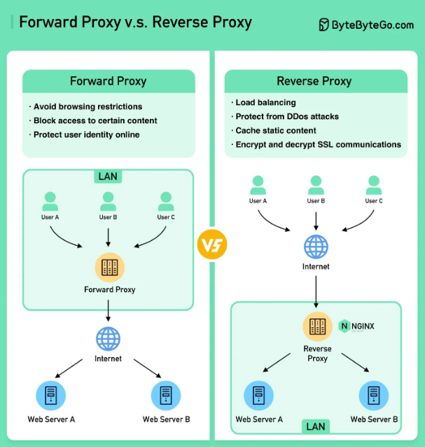
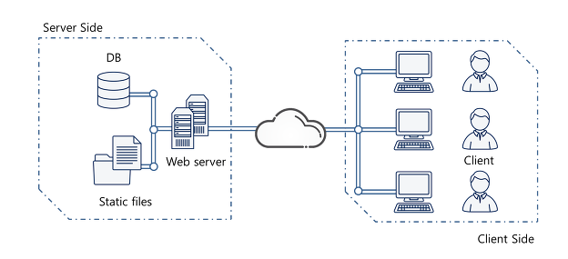
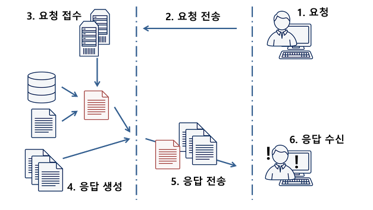
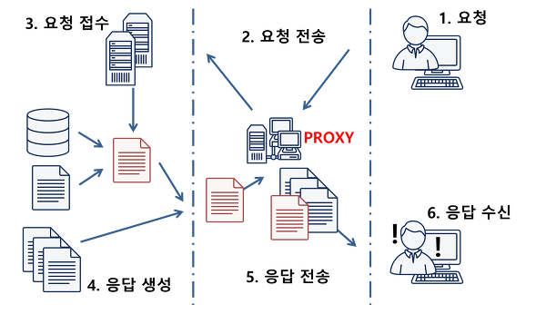
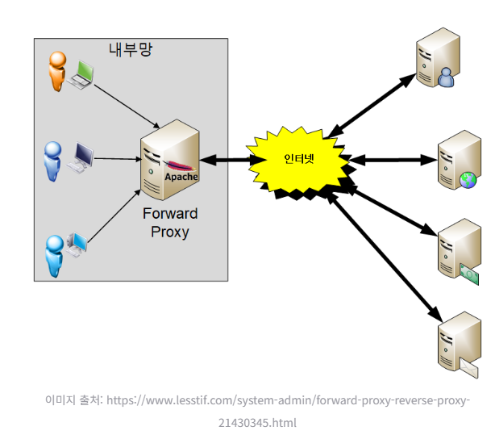
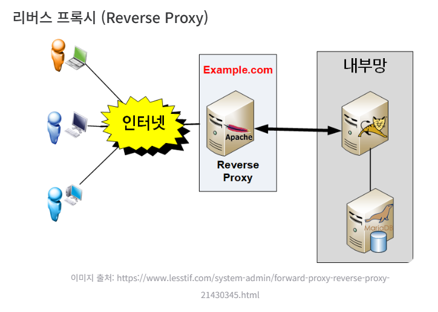
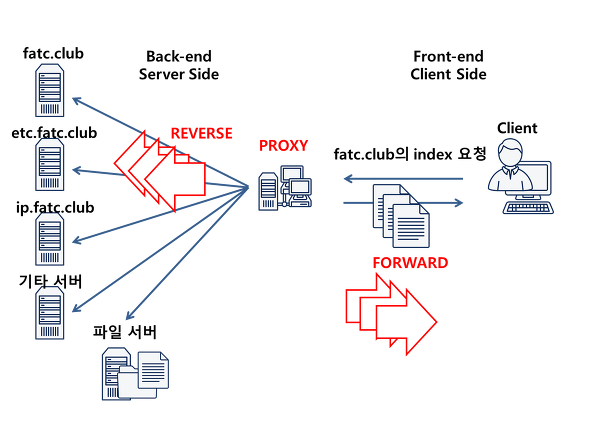

# Reverse Proxy (리버스 프록시)

### 모식도  

  

### 0. 웹 서비스의 전체 과정

- 일반적으로 웹 서비스는 `클라이언트 <-> 웹 <-> 웹 서버` 이렇게 3개의 영역을 관통하면서 제공됨
  - 클라이언트
    - 서비스를 이용하는 사용자로서, 웹에 접근하여 자신이 원하는 페이지, 파일을 요청   
    
  - 웹 서버
    - 웹을 통해 전달받은 요청에 맞는 데이터를 준비해서 응답   
  
- 위처럼 연속된 웹 서비스 절차는 모든 요청마다 발생하고 각 요청 1번에 많은 수의 세부 요청이 존재할 수 있음   
  (ex : 1개의 페이지당 보통 십수개의 파일 요청이 발생)  
  -> 많은 사용자가 이용 -> 웹 서버는 동일한 절차 중복 진행 -> `매번 동일한 파일을 응답` (ex : 각 포털사이트 메인 페이지)  
  -> `중복되는 요청을 매번 처리 시, 많은 자원 낭비 발생` -> 그래서 등장한 것이 `프록시 서버`
  
  

### 1. 프록시(Proxy)란?

- `Proxy`는 `대리` 또는 `대리인`이라는 의미를 가진 단어. 
- 클라이언트와 서버 간의 통신을 중계하는 서버나 소프트웨어 -> 서버 대신 무언가를 수행하는 용도의 서버

- 클라이언트는 서버에 직접 요청을 전송하지 않고 프록시를 통해 요청을 전송
- 해당 요청을 프록시가 받아서 서버에 대신 전달 후, 받은 응답을 클라이언트에게 전송 
- `Proxy 서버`의 주된 역할은 `웹 서비스 프로그램(이하 웹서버)의 컨텐츠 로드 부하 감소`임.  
  즉, 웹 서버 대신에 `정적 데이터`를 제공하는 `캐시`의 역할을 수행함
  
- 프록시 서버(Proxy Server)는 `포워드 프록시(Forward Proxy)`와 `리버스 프록시(Reverse Proxy)` 두 가지 유형으로 나뉨

  

### 2. 포워드 프록시(Forward Proxy)란 ? 

- 사용자 기기와 인터넷 사이에 위치하는 서버  
  일반적으로 말하는 `프록시`는 `포워드 프록시`를 의미하며 보통 단어를 혼용해서 사용함.  
  좀 더, 자세히 말하자면 클라이언트 바로 뒤에 위치한 개념.  
  사용자는 인터넷보다 프록시 서버를 먼저 호출.  
  프록시 서버는 `같은 내부망`에 존재하는 사용자의 요청을 `외부 네트워크(인터넷)`으로 중계함.   

  예를 들면, 유저가 www.naver.com에 접속하려고 하면 유저 pc가 직접 연결되는게 아니라 `포워드 프록시 서버`가 요청을 받아  
  www.naver.com에 연결하여 `그 결과를 유저에게 전달(Forward)`해줌.  
  그 결과, 서버에게 유저가 누군지 감추는 역할을 수행 (서버에서 받는 IP는 유저의 IP가 아니라 프록시 서버의 IP)

  

### 2-1. 용도
- 클라이언트 보호 (익명성)
  - 서버에서 받는 IP는 유저의 IP가 아니라, 프록시 서버의 IP이므로 유저의 IP주소와 신원을 숨길 수 있어 익명성과 개인 정보 보호 효과가 있음   

- 캐싱
  - 유저가 동일한 컨텐츠에 대해 다시 요청을 할 경우, 프록시는 원본 서버에 요청을 전달하는 대신 캐싱된 컨텐츠를 제공.   

  - 예를 들어, 100만명의 유저가 www.naver.com에 접근한다면, 본래 웹서버는 동일한 절차를 100만회 실행해야 하지만  
    정적 데이터의 경우, 유저 별 응답이 달라질 필요가 없으므로 `포워드 프록시`를 활용해 프록시 내 캐싱된 페이지를 로드함.  
    이를 통해, 클라이언트의 입장에선 빠르게 컨텐츠를 응답받을 수 있고 서버의 입장에선 불필요한 로드 감소로 인해 부하 완화 효과가 있음   
  

- 특정 콘텐츠에 대한 액세스 차단
  - 액세스 제어 정책을 설정해서 특정 사이트나 컨텐츠에 대한 액세스를 제한할 수 있음  
    이를 통해, 조직이나 기관에서 인터넷 사용을 관리하거나 악성 컨텐츠 필터링이 가능   

 

### 3. 리버스 프록시(Reverse Proxy)란 ?

- 인터넷망에 있는 클라이언트가 프록시 서버를 호출하여 내부망에 있는 서버를 호출하면 `리버스 프록시`임.  
  즉, 리버스 프록시는 서버의 앞단에 위치하여 클라이언트 요청을 여러 대상 서버로 분산하여 전달하는 역할 수행.   

- ex)  
  FATC.CLUB 웹서비스엔 3개의 서버가 존재
  - fatc.club : 블로그 담당 서버
  - etc.fatc.club : 블로그 내용 구현하여 보여주는 서버
  - ip.fatc.club : IP 제공 서비스 수행 서버
    

모든 요청은 1개의 Proxy 서버를 통해 들어온다고 했을 때, 어떻게 1~3번 서버를 구분해야 할까?  
=> `도메인`을 보고 어떤 서버로 해당 요청을 전달할 지 결정함.

이처럼 다수의 서버를 Proxy 서버 하단부에 위치시켜두고  
특정 조건(도메인)에 맞는 요청을 적절한 서버에게 전달해주는 역할을 수행하는 것이 `Reverse Proxy`임.   

한가지 명심할 것 => 하나의 `Proxy`서버는 `Reverse`와 `Forward`를 모두 수행할 수 있음.  
다만, 하나로 모든 것을 처리하기엔 부담되므로 둘로 나눈 것.   

`Reverse Proxy`를 이용하게 되면, 하나의 `프록시`로 다수의 서버(동일 서비스 or 다른 서비스던 상관 X) 요청 처리가 가능  
이로 인한 장점 중, 라이트 유저에게 가장 큰 장점은 1개의 IP로 다수의 웹 서비스 수행이 가능함.  
이러한 프록시 기능은 대다수의 HTTP 프레임워크에서 제공함 (ex : Apache, NginX 등)   

### 3-1. 장점
1) 서버 측면에서의 장점
   - 포워도 프록시의 캐싱 기능과 서버 load 부하 감소
     - 프록시의 본래 역할은 자주 사용되는 데이터를 확보해두고 이를 캐싱(재활용)하는 것 -> 서버의 load 부하 감소 효과   

   - 하나의 IP, 다수의 웹 서비스 사용자가 특정 도메인으로 요청 전송 시,  
     대부분의 DNS는 도메인 별 등록된 IP의 Well-known 포트 80(HTTP), 443(HTTPS)로 요청을 릴레이 함.   
   
     즉, 도메인 1개 <-> IP 1개 <-> 서버 1개, 이렇게 구성하는게 일반적이겠지만  
     한정된 IP 수량(IPv4 일 경우)과 가격 측면 그리고 관리 용이성 등 다양한 이유로 1개의 IP로 다수의 웹서버 동작 가능.   
     
     이 말은 곧 여러 개의 서버나 어플리케이션을 하나의 도메인으로 통합 가능함을 의미  
     -> 다양한 어플리케이션을 단일 진입점(entry point)에서 관리할 수 있으며, URL 라우팅, SSL 인증서 관리 등을 수행 가능   

  - 실제 서버에 직접적인 접근 차단
    - 외부에 노출되는 IP는 프록시 서버의 공인 IP이며, 실제 동작하는 서버는 사설 IP를 할당받아 동작함.  
      따라서, 망 분리를 통해 클라이언트가 직접적으로 서버의 IP를 알 수 없기 때문에 보안이 다소 취약한 HTTP 프레임워크를 숨겨 이를 보호할 수 있음  
      다만, 100% 보안이 완벽하진 않음.   

  - 리버스 프록시 뒤에 여러 개의 WAS를 두어, 사용자의 요청을 분산할 수 있음  
    앤드포인트(URL)마다 호출 서버를 설정할 수 잇어 역할에 따라 서버의 트래픽을 분산할 수 있음   

  - 정적 콘텐츠 캐싱처리
    - 자주 요청되는 컨텐츠를 저장 -> 동일한 요청에 대해 캐싱된 응답 제공   

2) 클라이언트 측면에서의 장점
- 클라이언트의 요청을 받아 프록시 서버가 백엔드 서버의 특정 서비스에 접근하게 되면  
  클라이언트의 IP가 전달되는 것이 아닌 프록시 서버의 IP가 요청과 함께 백엔드 서버에 전달되므로 클라이언트 정보가 캡슐화된다는 장점이 있음.  

  
  

### 자료 인용 출처
ref : https://jcdgods.tistory.com/322#none